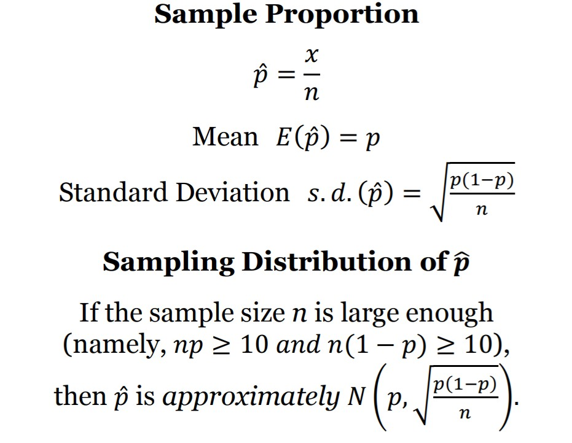
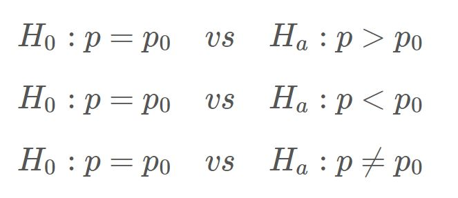
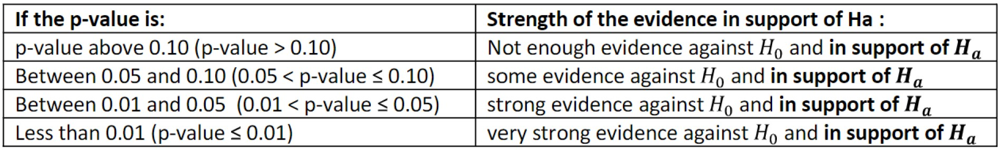

```{r setup, include=FALSE}
knitr::opts_chunk$set(echo = TRUE)
```


## Learning Objectives

### Statistical Learning Objectives
1. Review the difference between population proportions and sample proportions
2. Review the sampling distribution of the sample proportion
3. Carry out a hypothesis test for one population proportion
4. Optional: Estimate one population proportion 

### R Learning Objectives
1. Get more experience using user-built functions
2. Get some practice using R as a calculator

### Functions and Syntax
1. `randomSampleProportion()`
2. `samplingDistProportion()`
3. `onePopPropHT()`
4. Optional: `onePopPropCI()`


***


## Lab Tutorial

### Population Proportions

For the beginning of this lab, we will revisit the "employee" data set from the previous lab. This data set contains information for *all* of the employees in a certain company. Read in the data using the chunk below. 

```{r reademployee}
employee <- read.csv("employee.csv")
```

Feel free to explore the rest of the variables (and data set) on your own.

```{r previewemployee}
str(employee)
```

Some of the categorical variables include "minority", "female", and "manager". From these variables, we might be interested in determining...

- What proportion of employees are minorities?
- What proportion of employees are female?
- What percent of employees are managers?

Let's focus on the proportion of female employees. Because we have a data set that consists of *all* employees, we could calculate the *population* proportion of female employees at this company. The `table()` function could help us accomplish this!

```{r parameterEmployee}
addmargins(table(employee$female))
```

Here, a "yes" represents that the employee was a female - so 216 out of all 473 employees are female.

Let's use R as a calculator to compute this proportion. 

```{r populationProportion}
216 / 473
```

**Question:** The proportion of employees that are females is 0.4567 (or 45.67%). Is this value a *parameter* or a *statistic*?

**Answers:**

### Sample Proportions

Suppose we aren't able to collect information on *every* employee (for one reason or another). And instead, we can only collect a subset - or *sample* - of employees. 

Similar to the previous lab, we have created a function for you that will take a random sample of n observations from the provided data set. You must run the chunk below in order to use the `randomSampleProportion()` function. Note: you do not need to understand the contents of this code chunk. 

```{r sampleProportionFunction, echo = FALSE}
randomSampleProportion <- function(data, column, n){
  
  random_sample <- data[sample(1:nrow(data), n), column]
  print(paste("Variable:", colnames(data)[column]))
  print(paste("Generated Random Sample of Size", n))
  print(random_sample)
  print(paste("Sample Proportion:", mean(random_sample == "yes")))
  
}
```

To use this function, input the data set (`data`), the column number of interest, and the desired sample size (`n`). Let's try calculating the sample proportion of female employees for a random sample of 20 employees (n = 20). Note: column 8 is the female variable. 

```{r sampleProportion}
randomSampleProportion(data = employee, column = 8, n = 20)
```

**Question:** What sample proportion did you get? Is it the same as your instructor? Is it the same as the student next to you? 

**Answer:**


Probably not - because you took a *random sample* of 20 employees and calculated a sample proportion. 

**This statistic will vary from sample to sample!**

Feel free to run the code chunk above a few times to see how the sample proportion bounces around with each new random sample. 

**Demo #1**: Use the `randomSampleProportion()` function to calculate the sample proportion of female employees for a random sample of 120 employees (n = 120). 

```{r demo1, error = T}
# Replace this text with your code

```

Again, try running the code chunk a few times to see how the sample proportion varies from sample to sample.


### Sampling Distribution of the Sample Proportion

We can use simulation to help us visualize how the sample proportion varies from sample to sample. Run the code chunk below to create the `samplingDistProportion()` function. This function will:

1. Take a random sample of size n from the population of data provided
2. Calculate the sample proportion for this random sample (and store it)
3. Repeat this process 99 more times 
4. Plot the 100 sample proportions 

Note: you do not need to understand the contents of this code chunk. 

```{r samplingDistributionFunction, echo = FALSE}
samplingDistProportion <- function(data, column, n){
  
  sample_proportions <- rep(0, 100)
  
  for(i in 1:100) {
    randomSample <- data[sample(1:nrow(data), n), column]
    sample_proportions[i] <- mean(randomSample == "yes")
  }

  stripchart(sample_proportions, method = "stack", pch = 20, at = 0,
             main = bquote(paste("Sampling Distribution of ", hat(p))),
             ylab = "Frequency",
             xlab = paste("100 Sample Proportions (from Samples of Size n = ", 
                          n, ")", sep =""))

}
```

This function uses the exact same inputs as the `randomSampleProportion()` function from earlier. Let's get an idea of the sampling distribution for the sample proportion of female employees (for random samples of size 20). 

```{r samplingdistributionExample}
samplingDistProportion(data = employee, column = 8, n = 20)
```

We only simulated 100 sample proportions using the above function. We could add more and more sample proportions to get a better picture of the true sampling distribution of the sample proportion. But this is a good start! 

We see that the sampling distribution is centered around 0.45 or so. (Remember, the population proportion was 0.4567). We also see that the sample proportions vary by quite a bit! 

**Demo #2**: Use the `samplingDistProportion()` function to plot a bunch of sample proportions of female employees (for a random samples of size 120). 

```{r demo2, error = T}
# Replace this text with your code

```

**Question:** What effect, if any, did the increase in sample size (from 20 to 120) have on the center of the sampling distribution? What about on the variability of the sample proportions? 

**Answer:**

Some conclusions!

{width=300px}

**Result #1**: The expected value (or center) of the sampling distribution of the sample proportion (E(phat)) is equal to the population proportion (p). 

**Result #2**: The standard deviation (or spread) of the sampling distribution of the sample proportion (sd(phat)) decreases as the sample size increases. 

**Result #3**: The shape of the sampling distribution of the sample proportion can be approximated with a normal distribution when the sample size is large enough.

### HT for One Population Proportion

A hypothesis test helps us judge whether or not a statement about a population is reasonable or not. The procedure for running any hypothesis test involves three steps:

1. Stating two competing hypotheses about an unknown parameter
2. Analyzing the evidence collected from sample data
3. Making a decision about whether or not the sample data supports the new theory

Let's start with running a hypothesis test for one population proportion. The possible hypotheses for the hypothesis test are:

{width=300px}

For a hypothesis test, we use the proportion stated in the null hypothesis (p0). **During a hypothesis test, we assume that the null hypothesis is true** for the calculations of our test statistic and corresponding p-value. The resulting p-value helps us determine how much evidence we have against the null hypothesis (and in favor of the alternative hypothesis). The smaller the p-value, the more evidence we have against the null.

We can use the table below as a general guideline!

{width=600px}


Note: the p-value is *not* the probability that the null hypothesis is true. The p-value is the probability of a result as extreme (or more extreme) as the observed test statistic (in the direction of the alternative hypothesis) *assuming the null hypothesis is true*.

Yet again, R doesn't have any helpful functions built-in for running this hypothesis test so we have created one for you. Run the following code chunk to create the `onePopPropHT()` function. Note: you do not need to understand the contents of this code chunk. 

```{r onePopPropHTfunction, echo = FALSE}

onePopPropHT <- function(x, n, p0, alt = "two.sided"){
  
  # Calculates the sample proportion and z test statistic
  phat <- x / n
  
  # Calculates the null standard deviation
  null.sd <- sqrt((p0 * (1 - p0)) / n)
  
  # Calculates the z test statistic
  z.test.stat <- (phat - p0) / null.sd
  
  # Calculates the p-value (based on the alternative hypothesis provided - default is two-sided)
  if (alt == "greater") {p.value <- pnorm(z.test.stat, lower.tail = FALSE)
  } else if (alt == "less") {p.value <- pnorm(z.test.stat, lower.tail = TRUE)
  } else if (alt == "two.sided") {p.value <- 2 * pnorm(abs(z.test.stat), lower.tail = FALSE)
  }
  
  # Returns list of helpful values
  return(list("phat" = phat, "null.sd" = null.sd, "test.stat" = z.test.stat, "p.value" = p.value))
}
```

The `onePopPropHT()` function has four arguments:

1. `x`: observed number of "successes"
2. `n`: sample size 
3. `p0`: hypothesized proportion
4. `alt`: alternative hypothesis ("less", "greater", or "two.sided")

Let's try it out! 

(Example from Lecture - Page 115) About 10% of the human population is left-handed. Suppose a researcher speculates that artists are *more* likely to be left-handed than are other people in the general population. The researcher surveys a random sample of 150 artists and finds that 18 of them are left-handed. 

```{r onePopPropHTexample}
onePopPropHT(x = 18, n = 150, p0 = 0.10, alt = "greater")
```

**Question:** How much evidence (not enough, some, strong, or very strong) do we have against the null hypothesis and in support of the alternative (the claim that artists are *more* likely to be left-handed than are other people in the general population)? 

**Answer:**

Our conclusion? We do *not* have sufficient support to suggest that the population proportion of artists that are left-handed is *greater* than 10%.

**Demo #3:** In a student survey that was sent out to all Stats 250 students during Winter 22, 30 out of 230 students believe that ketchup could be considered jam (because tomatoes are technically fruit). Use this data (which we will consider a random sample of students) to test if we have enough evidence to conclude that *fewer* than a fifth (20%) of all students believe that ketchup can be considered jam. 

**Question:** Write out your null and alternative hypotheses for this test. 

**Answer:** H0:____      *vs* Ha: _________

Then, use the `onePopPropHT()` function to calculate your p-value.

```{r demo3, error = T}
# Replace this text with your code

```

**Question:** How much evidence (not enough, some, strong, or very strong) do you have against the null hypothesis (H0) and in support of the alternative hypothesis (Ha)? 

**Answer:**

**Question:** Write a conclusion in context.

**Answer:**


### *Optional: CI for One Population Proportion*

A confidence interval is used to *estimate* a parameter. It gives us a *range of reasonable values* for the parameter. In this lab, we will estimate a population proportion (p).

The best method to estimate an unknown population proportion is to take a random sample and calculate its sample proportion. We know (and saw above) that this value will not be a perfect estimate of the unknown population proportion - it varies from sample to sample. So instead of only reporting the sample proportion, we provide a range (or interval) that gives our estimate some "wiggle room".

Formally, we calculate the sample proportion (phat) and add/subtract the *margin of error* to/from it. The margin of error is calculated by multiplying the standard error of the sample proportion by the z* multiplier. 

There aren't any functions built into R that help us create these confidence intervals so we have created a function for you.

Run the following code chunk to create the `onePopPropCI()` function. Note: you do not need to understand the contents of this code chunk. 

```{r onePopPropCIfunction, echo = FALSE}

onePopPropCI <- function(x, n, confidence = 0.95){
  
  # Calculates the sample proportion
  phat <- x / n
  
  # Calculates the standard error
  se.phat <- sqrt((phat * (1 - phat)) / n)
  
  # Finds the z* multiplier
  z.multiplier <- qnorm((1 - confidence) / 2, lower.tail = FALSE)
  
  # Calculates the lower and upper bound of the interval
  lower.bound <- phat - z.multiplier*se.phat
  upper.bound <- phat + z.multiplier*se.phat
  
  # Returns a sentence with the results
  return(paste("The ", confidence*100, "% confidence interval is given as: (",
               round(lower.bound,4), ", ", round(upper.bound,4),").", sep = ""))
}

```

The `onePopPropCI()` function has three arguments:

1. `x`: observed number of "successes"
2. `n`: sample size 
3. `confidence`: confidence level (the default is 0.95)

Let's try it out!

(Example from Lecture - Page 128) In a Gallup Youth Survey, 500 randomly selected American teenagers were asked about how well they get along with their parents. One survey result was that 270 of the 500 sampled teens said they get along “very well” with their parents. Compute a 95% confidence interval for the population proportion of all American teenagers that say they get along "very well" with their parents.

For this data, our sample size check holds (feel free to double check if you'd like) so we can proceed with creating the confidence interval. 

```{r onePopPropCIexample}
onePopPropCI(x = 270, n = 500, confidence = 0.95)
```

Could we conclude that a majority (greater than 50%) of all American teenagers get along "very well" with their parents?

**Demo #4:** In a student survey that was sent out before break, 52 out of 230 students claimed that a straw has one hole (rather than two). Use this data (which we will consider a random sample of students) and the `onePopPropCI()` function to create a *90%* confidence interval that estimates the population proportion of students who believe a straw has one hole. 

```{r demo4, error = T}
# Replace this text with your code

```

Think about how you would interpret this interval in context.

## Try It!

Complete the following exercises. Remember, the "Try It" questions will typically be code-based and will be graded for **completeness**. Be sure to give *every* question your best shot! We strongly encourage you to form small groups and work together.

We gathered 230 responses from a student survey sent out to all Stats 250 students during the Winter 22 semester. We will assume that this is a random sample of students. Some of the data was used in the demos above - the rest will be used below.

Choose your own *Hypothesis Test* adventure! 

- **Scenario #1:** 58 out of 230 students believe that a hot dog can be considered a sandwich. Determine if we have enough evidence to suggest that fewer than a third (33%) of students believe a hot dog can be considered a sandwich. 
- **Scenario #2:** 117 out of 230 students believe that pineapple belongs on pizza. Determine if we have enough evidence to suggest that a majority (50%) of students believe that pineapple belongs on pizza.  
- **Scenario #3:** 135 out of 230 students say soda (instead of pop). Determine if we have enough evidence to suggest that a majority (50%) of students students say soda (instead of pop). 

> **1.** For Try It section, choose one of the hypothesis test adventures above (Scenarios 1 - 3) and report your choice below.

*Answer:* Scenario #


> **2.** Write out the null and alternative hypotheses for your scenario using the appropriate parameter symbol.

*Answer:* H0:           *vs* Ha:        

> **3.** Write out the definition of the parameter in context. 

*Answer:* The parameter ____  represents        


> **4.** Use the `onePopPropHT()` function to run a hypothesis test for your scenario. Report the z-test statistic and p-value below. 

```{r tryIt7, error = T}
# Replace this text with your code

```

*Answer:* Replace this text with your answer.

> **5.** Write an interpreation of the z-test statistic. 

*Answer:* Replace this text with your answer.


> **6.** What is the strength of evidence against the null hypothesis (and in support of the alternative hypothesis)?  

*Answer:* Replace this text with your answer.


***


## Dive Deeper

Complete the following questions. Remember, the "Dive Deeper" questions will involve analyzing the results and will be graded for **correctness**. If you have any questions, please ask for help (in lab, in office hours, or on Piazza)!

> **1.** Suppose we doubled the sample size from 230 students to 460 students for your hypothesis test scenario above. If we (hypothetically) happened to find the same sample proportion, would you expect the resulting p-value to decrease, increase, or stay the same as the one you computed in Try It 4? Briefly explain your answer. 

*Answer:* Replace this text with your answer.


> **2.** In the left-handed artists hypothesis test example from the lab tutorial (around line 245), the p-value was found to be 0.2071. Why is the following statement incorrect? *"With a p-value of 0.2071, there is a 20.71% chance that the null hypothesis is true (i.e., that 10% of all artists are left handed)."* 

*Answer:* Replace this text with your answer.


***


## Submission Instructions

Carefully follow the instructions below to submit your work.

1. At the top of this document, change the `author` field to your name (in quotes!). 

2. Click the **Knit** button one last time.

3.  In the Files pane (the bottom right window), check the box next to "lab05report.html".

4. Click More > Export... 

5. Leave the name of the file as "lab05report.html". **Do not change the file name.** Click Download and save the file to your computer.  

6.  On the Stats 250 Canvas site, click the "Assignments" panel on the left side of the page. Scroll to find "Lab 5", and open the assignment. Click "Start Assignment". 

7.  At the bottom of the page, upload your saved "lab05report.html" file. 

8.  Click "Submit Assignment". 
