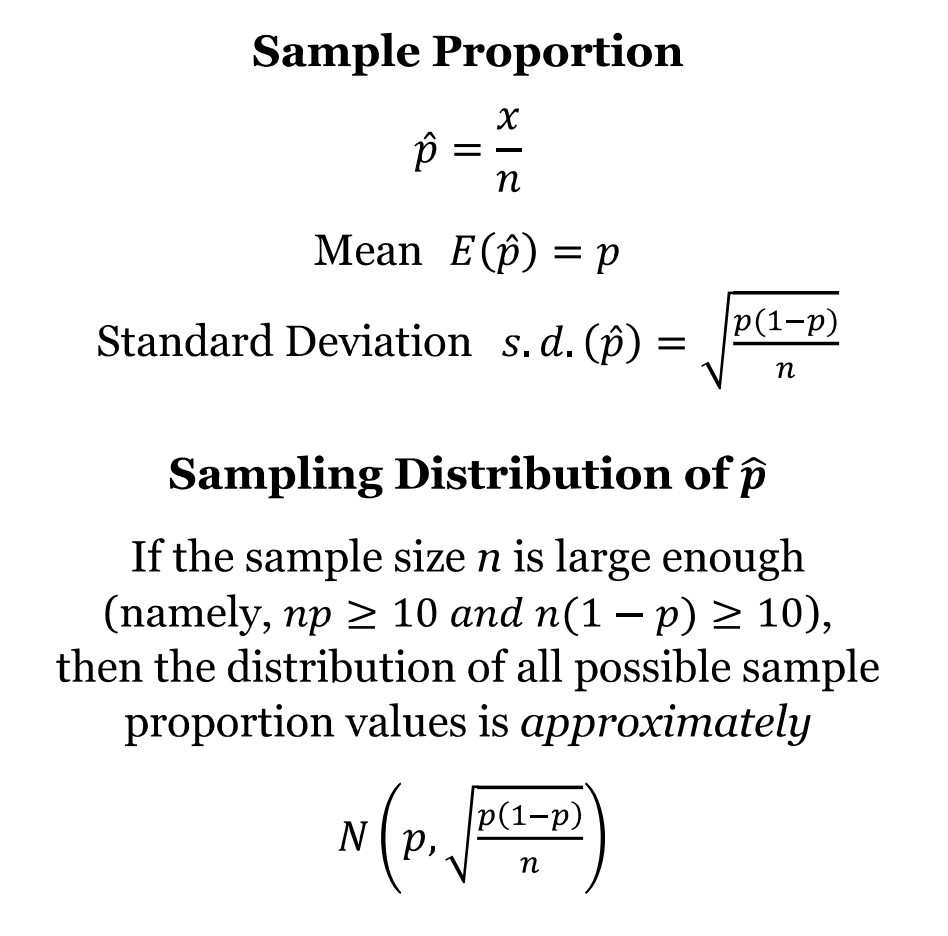
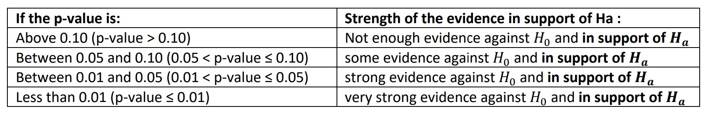

```{r setup, include=FALSE}
knitr::opts_chunk$set(echo = TRUE)
```

## Learning Objectives
1. Population proportions and sample proportions
2. Review the sampling distribution of the sample proportion
3. Carry out a hypothesis test for a population proportion
4. Estimate a population proportion using a confidence interval

### Functions
1. `randomSampleProportion()`
2. `samplingDistProportion()`
3. `onePopPropHT()`
4. `onePopPropCI()`


***


## R Packages

We will be using functions from the stats250package again this week. To load the package, we need to run the following code chunk:

```{r loadStats250Pacakge}
library(stats250package)
```


***


## Statistical Review

### Parameters vs Statistics

In lecture, you have learned about the following terms:

- Parameter: a summary value calculated from a population
- Statistic: a summary value calculated from a sample

The parameter is a fixed quantity that summarizes the entire population of interest. But what about the statistic - specifically the sample proportion? You have discussed some of the following ideas in lecture:

- The sample proportion is the proportion of "successes" out of a random sample of observations
- The sample proportion will vary from sample to sample
- This variability will decrease if the size of the sample is increased
- The sampling distribution of the sample proportion helps us visualize how we expect a sample proportion to vary from sample to sample


### Proportions vs Means

When do we use one versus the other?

- Proportions are used to help summarize a **categorical** variable, specifically when the response is a yes/no scenario
- Means are used to help summarize a **quantitative** variable by calculating the average value of some numeric response

In Lab 3, we focused on means. In this lab, we will focus on proportions. 


### Hypothesis Tests vs Confidence Intervals

When do we use one versus the other?

- Hypothesis tests help us **evaluate a claim** made about an unknown parameter of interest 
- Confidence intervals help us **estimate** an unknown parameter of interest

We will see how to perform both inferences using R. 


***


## Coding Examples

### The Population

For the beginning of this lab, we will revisit the "employee" data set from the previous lab. This data set contains information for *all* of the employees in a certain company. Read in the data using the chunk below. 

```{r reademployee}
employee <- read.csv("employee.csv")
```

Feel free to explore the rest of the variables (and data set) on your own.

```{r previewemployee}
str(employee)
```

Some of the categorical variables include "minority", "female", and "manager". From these variables, we might be interested in determining...

- What proportion of employees are minorities?
- What proportion of employees are female?
- What percent of employees are managers?

Let's focus on the proportion of female employees. Because we have a data set that consists of *all* employees, we could calculate the *population* proportion of female employees at this company. The `table()` function could help us accomplish this!

```{r parameterEmployee}
addmargins(table(employee$female))
```

Here, a "yes" represents that the employee was a female - so 216 out of all 473 employees are female.

```{r populationProportion}
216 / 473
```

Using R as a calculator, we find that the *population proportion* of employees that are female is 0.4567 (or 45.67%). This value would represent a *parameter*.


### Sample Proportions

Suppose we aren't able to collect information on *every* employee (for one reason or another). And instead, we can only collect a subset - or *sample* - of employees. 

The `randomSampleProportion()` function will help us take a random sample from the desired data set and calculate the sample proportion.

The function takes the following arguments:

- `data`: the name of the data set
- `n`: the desired size of the sample 
- `column`: the column number for the variable of interest

Let's try calculating the sample proportion of female employees for a random sample of 20 employees (n = 20). Note: the variable female is located in column 8. 

```{r sampleProportion}
randomSampleProportion(data = employee, n = 20, column = 8)
```

What sample proportion did you get? Is it the same as your instructor? Is it the same as the student next to you? Probably not - because you took a *random sample* of 20 employees and calculated a sample proportion. 

**This statistic will vary from sample to sample!**

Feel free to run the code chunk above a few times to see how the sample proportion bounces around with each new random sample. 

**Demo #1**: Use the `randomSampleProportion()` function to calculate the sample proportion of female employees for a random sample of 120 employees (n = 120). 

```{r demo1, error = T}
# Replace this text with your code

```

Again, try running the code chunk a few times to see how the sample proportion varies from sample to sample.

Think About It: Will the sampling distribution of the sample proportion be wider or narrower with an increased sample size?


### Sampling Distribution of the Sample Proportion

We will use the `samplingDistProportion()` function to help us visualize how the sample proportion varies from sample to sample. This function will:

1. Take a random sample of size n from the population
2. From this random sample, compute the sample proportion
3. Save the value of the sample proportion computed in Step 2
4. Repeat Steps 1 - 3 many, many times 
5. Create a histogram of the many, many saved sample proportions

This function uses the exact same inputs as the `randomSampleProportion()` function from earlier. Let's get an idea of the sampling distribution for the sample proportion of female employees (for random samples of size 20). 

```{r samplingdistributionExample}
samplingDistProportion(data = employee, n = 20, column = 8)
```

We only simulated 100 sample proportions using the above function. We could add more and more sample proportions to get a better picture of the true sampling distribution of the sample proportion. But this is a good start! 

We see that the sampling distribution is centered around 0.45 or so. (Remember, the population proportion was 0.4567). We also see that the sample proportions vary by quite a bit! 

**Demo #2**: Use the `samplingDistProportion()` function to plot a bunch of sample proportions of female employees (for a random samples of size 120). 

```{r demo2, error = T}
# Replace this text with your code

```

We should find that the sampling distribution is still centered around 0.4567 and that the sample proportions vary by less (compared to when the sample size was 20).

Think About It: True/False - In Demo 2, the sampling distribution of the sample proportion is approximately normal because the sample size is large enough (at least 25) to use the Central Limit Theorem.


Some conclusions!

{width=300px}

**Result #1**: The expected value (or center) of the sampling distribution of the sample proportion (E(phat)) is equal to the population proportion (p). 

**Result #2**: The standard deviation (or spread) of the sampling distribution of the sample proportion (sd(phat)) decreases as the sample size increases. 

**Result #3**: The shape of the sampling distribution of the sample proportion can be approximated with a normal distribution when the sample size is large enough.


### HT for One Population Proportion

A hypothesis test helps us judge whether or not a statement about a parameter is reasonable or not. The procedure for running any hypothesis test involves three steps:

1. Determine appropriate null and alternative hypotheses 
2. Check the assumptions for performing the test  
3. Calculate the observed sample proportion and the test statistic. Then, determine the p-value.
4. First, evaluate the p-value and determine the amount of evidence against the null hypothesis. Then, make a conclusion in the context of the problem.

Let's start with running a hypothesis test for one population proportion. The possible hypotheses for the hypothesis test are:

{width=300px}

For a hypothesis test, we use the proportion stated in the null hypothesis (p0). **During a hypothesis test, we assume that the null hypothesis is true** for the calculations of our test statistic and corresponding p-value. The resulting p-value helps us determine how much evidence we have against the null hypothesis (and in favor of the alternative hypothesis). The smaller the p-value, the more evidence we have against the null.

We can use the table below as a general guideline!

{width=600px}

Note: the p-value is *not* the probability that the null hypothesis is true. The p-value is the probability of a result as extreme (or more extreme) as the observed test statistic (in the direction of the alternative hypothesis) *assuming the null hypothesis is true*.

R doesn't have any helpful functions built-in for running this hypothesis test so we have created one for you - it's called `onePopPropHT()`.

The function takes the following arguments:

- `x`: observed number of "successes"
- `n`: sample size 
- `p0`: hypothesized proportion
- `alt`: the direction of the alternative hypothesis (the options are: "less", "greater", or "two.sided" - this text must be input with quotes)

Let's try it out! 

(From Lecture 11) According to the University of Michigan’s Student profile, 14% of undergraduate students at U-M are first-generation college students. Is the proportion of students in Stats 250 who are first-generation college students *lower* compared to the rate stated on UM’s student profile website? 

We take a random sample of 120 Stats 250 students, and find that 12 of the students are first-generation students.

```{r HTexample}
onePopPropHT(x = 12, n = 120, p0 = 0.14, alt = "less")
```

If you got an error running the above code, be sure to load in the stats250package by running the code chunk around line 37.

Based on this test statistic and this p-value, what can we say?

- **Evaluation:** With a p-value of 0.1033, there is not enough evidence against the null hypothesis and in support of the alternative. 
- **Conclusion:** Based on the data, we do not have enough evidence to suggest that less than 14% of all Stats 250 students are first-generation college students. 


**Demo #3:** In a student survey from a prior semester, 30 out of 230 students believe that ketchup could be considered jam (because tomatoes are technically fruit). Use this data (which we will consider a random sample of students) to test if we have enough evidence to conclude that *less* than a fifth (20%) of all students believe that ketchup can be considered jam. First, think about how you would write out your null and alternative hypotheses for this test. Then, use the `onePopPropHT()` function to calculate the p-value.

```{r demo3, error = T}
# Replace this text with your code

```

Think About It: How would you evaluate this p-value? What would your conclusion be?


**Think-Pair-Share #1:** Consider the following questions:

- When calculating the p-value, what is assumed to be true?
- Suppose (in Demo 3), we had found a sample proportion (phat) of 0.10 (23 out of 230 students believe that ketchup could be considered jam). Would our p-value increase, decrease, or stay the same? Does this mean we have more or less evidence in favor of the alternative hypothesis? 


### CI for One Population Proportion

A confidence interval is used to **estimate an unknown parameter**. The interval gives us a **range of reasonable values for the parameter**. In this lab, we will estimate a population proportion (p).

The best method to estimate an unknown population proportion is to take a random sample and calculate its sample proportion (phat). We know (and saw above) that this value will not be a perfect estimate of the unknown population proportion - it varies from sample to sample. So instead of only reporting the sample proportion, we provide a range (or interval) that gives our estimate some "wiggle room".

Formally, we calculate the sample proportion (phat) and add/subtract the *margin of error* to/from it. The margin of error is calculated by multiplying the standard error of the sample proportion by the z* multiplier. 

There aren't any functions built into R that help us create these confidence intervals so we have created a function for you - it's called `onePopPropCI()`.

The function takes the following arguments:

- `x`: observed number of "successes"
- `n`: sample size 
- `confidence`: confidence level (the default is 0.95)

Let's try it out! 

(From Lecture 12) Suppose we take a random sample of 100 recent college graduates and record whether the student completed their degree within 4 years. For this sample of 100 recent graduates, 64 reported completing their degree within 4 years. 

Using this sample result, compute a 95% confidence interval for estimating the population proportion (p) of all recent college graduates who completed their degree within 4 years.

```{r onePopPropCIexample}
onePopPropCI(x = 64, n = 100, confidence = 0.95)
```

We are 95% confident that the population proportion of all recent college graduates who completed their degree within 4 years lies within the interval 0.5459 to 0.7341.

Think About It: Based on this interval, could we suggest that a majority (greater than 50%) of all recent college graduates complete their degree within 4 years?


**Demo #4:** In Demo #3, we ran a hypothesis test to determine if less than a fifth of all students believe that ketchup can be considered jam. Suppose we didn't have any preconceived belief about the population proportion and wished to simply estimate the true value instead. Use the collected data (30 out of 230 students) and the `onePopPropCI()` function to create a *90%* confidence interval that estimates the population proportion of students who believe that ketchup can be considered jam.  

```{r demo4, error = T}
# Replace this text with your code

```

Think About It: How you would interpret this interval in context?

**Think-Pair-Share #2:** Consider the following questions:

- What component(s) of the confidence interval impact the center of the interval?
- What component(s) of the confidence interval impact the width of the interval?
- Bonus Question: Our interval in Demo #4 was created using a confidence *level* of 90%. What exactly does this mean? 


If you are interested in learning how to calculate probabilities (or find multipliers) using R, you can check out the additional section below at a later time! For now, click on the file titled `lab04assignment.Rmd` in the bottom right window to open up the lab assignment for today. 


### Optional!

#### Probabilities from a Normal Distribution

To calculate probabilities from a normal distribution, we can use the Shiny App (linked on Canvas) or we can use the `pnorm()` function in R!

The function takes the following arguments:

- `q`: the observed value, used as the lower (or upper) bound
- `mean`: the mean of the normal distribution 
- `sd`: the standard deviation of the normal distribution
- `lower.tail`: the direction - if set to TRUE, the function will calculate the probability of observing a value less than q; if set to FALSE, the function will calculate the probability of observing a value greater than q

Suppose we had a normal distribution with a mean of 60 and a standard deviation of 5. If we were interested in finding the probability of observed a value of at least 68, we would use the following code:

```{r pnormExample1}
pnorm(q = 68, mean = 60, sd = 5, lower.tail = FALSE)
```

Suppose we were interested in finding the probability of observed a z-score (or z-test statistic) of at most -2.4, we would use the following code:

```{r pnormExample2}
pnorm(q = -2.4, mean = 0, sd = 1, lower.tail = TRUE)
```

Feel free to plug either of these into the Shiny App to confirm the values!


#### Finding z* Multipliers

To create a confidence interval for a population proportion, we need the z* multiplier that corresponds to the desired confidence level. To find this, you can use the t-Table on the formula sheet, or you can use the `qnorm()` function in R. 

- `q`: the desired percentile (more on this below)
- `mean`: the mean of the normal distribution 
- `sd`: the standard deviation of the normal distribution
- `lower.tail`: for the setup described below, we will set this to FALSE

The `q` input is the percentile that corresponds to our desired confidence level. If we want to create a 90% confidence interval, this leaves 10% left over in both tails of our sampling distribution (see the Lecture 12 slides) - or 5% in each tail. The z* multiplier is the z-score that corresponds to the 5th percentile or the 95th percentile. Which is why we would plug in a q of 0.05 for a 90% confidence interval.

```{r qnormExample1}
qnorm(p = 0.05, mean = 0, sd = 1, lower.tail = FALSE)
```

What about for a 95% confidence interval? This leaves 5% left over in both tails, or 2.5% in each tail. So we would have the following code. 

```{r qnormExample2}
qnorm(p = 0.025, mean = 0, sd = 1, lower.tail = FALSE)
```

And then finally, for a 99% confidence interval? This leaves 1% left over in both tails, or 0.5% in each tail. So we would have the following code.

```{r qnormExample3}
qnorm(p = 0.005, lower.tail = FALSE)
```

Note: the default mean and sd are 0 and 1, so we don't actually need to specify those (as seen in example 3)!


